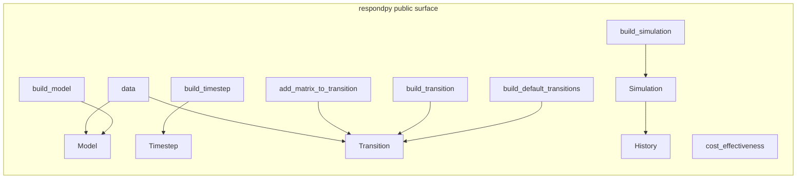
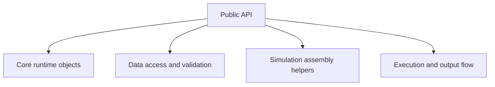

# Architecture

This section explains the public API and runtime behavior of respondpy.
It is intentionally conceptual: there are no references pages here and no
how-to recipes.

If you need task-oriented steps, use [How-To Guides](../how_to/data_loading.md).
If you need API signatures and symbol-level details, use
[References](../references/wrapper_typing.md).
If you want guided learning exercises, use
[Tutorials](../tutorials/base_respond.md).

```{toctree}
:maxdepth: 1

public-api
object-lifecycle
data-flow
runtime-execution
```

## Overview



## Scope


