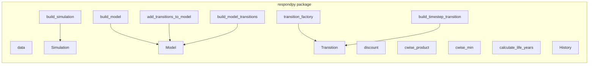
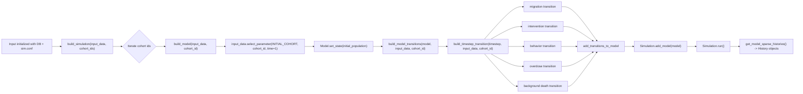
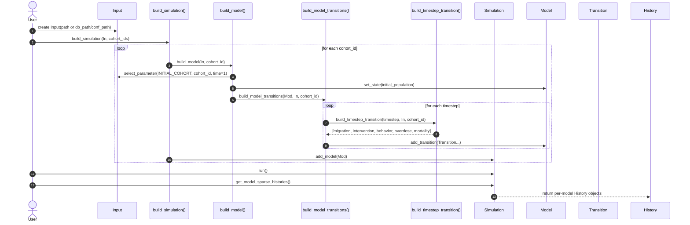

# Architecture

This page summarizes the public surface and runtime flow of respondpy.

## Public API

```mermaid
flowchart LR
	subgraph Pkg[respondpy package]
		data[data]
		discount[discount]
		cwise_product[cwise_product]
		cwise_min[cwise_min]
		calculate_life_years[calculate_life_years]

		History[History]
		Model[Model]
		build_model[build_model]
		add_transitions_to_model[add_transitions_to_model]
		build_model_transitions[build_model_transitions]

		Simulation[Simulation]
		build_simulation[build_simulation]

		Transition[Transition]
		transition_factory[transition_factory]
		build_timestep_transition[build_timestep_transition]
	end

	build_simulation --> Simulation
	build_model --> Model
	add_transitions_to_model --> Model
	build_model_transitions --> Model
	transition_factory --> Transition
	build_timestep_transition --> Transition
```

## Execution Diagram

```mermaid
flowchart LR
	A[Input initialized with DB + sim.conf] --> B["build_simulation(input_data, cohort_ids)"]
	B --> C{Iterate cohort ids}
	C --> D["build_model(input_data, cohort_id)"]
	D --> E["input_data.select_parameter(INITIAL_COHORT, cohort_id, time=1)"]
	E --> F["Model.set_state(initial_population)"]
	F --> G["build_model_transitions(model, input_data, cohort_id)"]
	G --> H["build_timestep_transition(timestep, input_data, cohort_id)"]
	H --> I["migration transition"]
	H --> J["intervention transition"]
	H --> K["behavior transition"]
	H --> L["overdose transition"]
	H --> M["background death transition"]
	I --> N["add_transitions_to_model"]
	J --> N
	K --> N
	L --> N
	M --> N
	N --> O["Simulation.add_model(model)"]
	O --> P["Simulation.run()"]
	P --> Q["get_model_sparse_histories() -> History objects"]
```

## UML Library Flow

```mermaid
sequenceDiagram
	autonumber
	actor User
	participant In as Input
	participant BS as build_simulation()
	participant BM as build_model()
	participant BMT as build_model_transitions()
	participant BTT as build_timestep_transition()
	participant Sim as Simulation
	participant Mod as Model
	participant Tr as Transition
	participant Hist as History

	User->>In: create Input(path or db_path/conf_path)
	User->>BS: build_simulation(In, cohort_ids)
	loop for each cohort_id
		BS->>BM: build_model(In, cohort_id)
		BM->>In: select_parameter(INITIAL_COHORT, cohort_id, time=1)
		BM->>Mod: set_state(initial_population)
		BM->>BMT: build_model_transitions(Mod, In, cohort_id)
		loop for each timestep
			BMT->>BTT: build_timestep_transition(timestep, In, cohort_id)
			BTT-->>BMT: [migration, intervention, behavior, overdose, mortality]
			BMT->>Mod: add_transition(Transition...)
		end
		BS->>Sim: add_model(Mod)
	end
	User->>Sim: run()
	User->>Sim: get_model_sparse_histories()
	Sim-->>Hist: return per-model History objects
```
