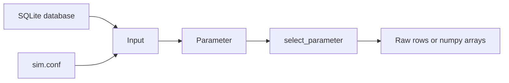
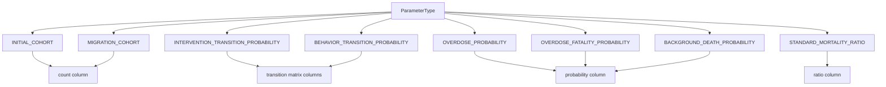
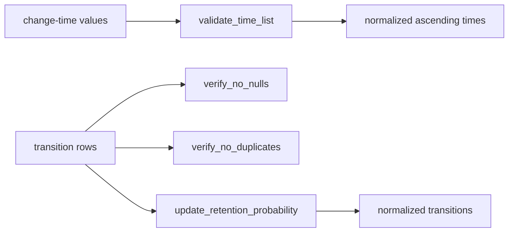

# Explanation: Data Flow

This page follows the path from persisted RESPOND inputs to model-ready arrays
and transition matrices.

See also:
- [How-To: Load RESPOND Input Data](../how_to/load_input_data.md)
- [References: respondpy.data](../references/data.md)
- [Tutorial: Parameter Change-Time Experiment](../tutorials/parameter_change_experiment.md)

## Input Processing

## Parameter Mapping

## Validation and Normalization

