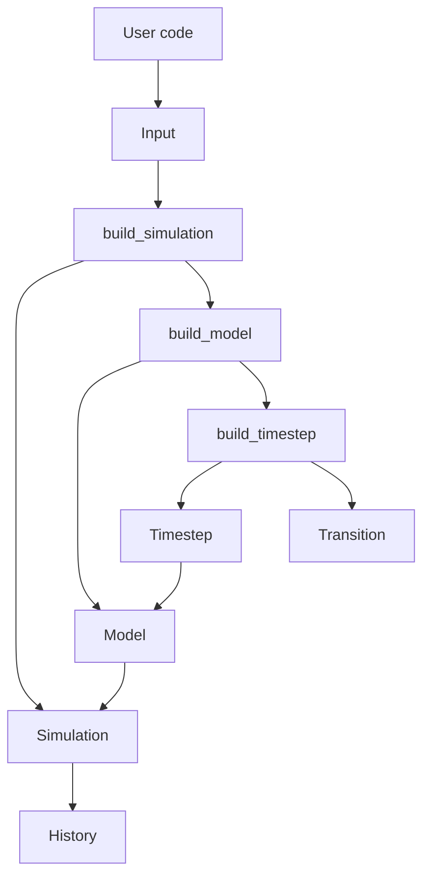
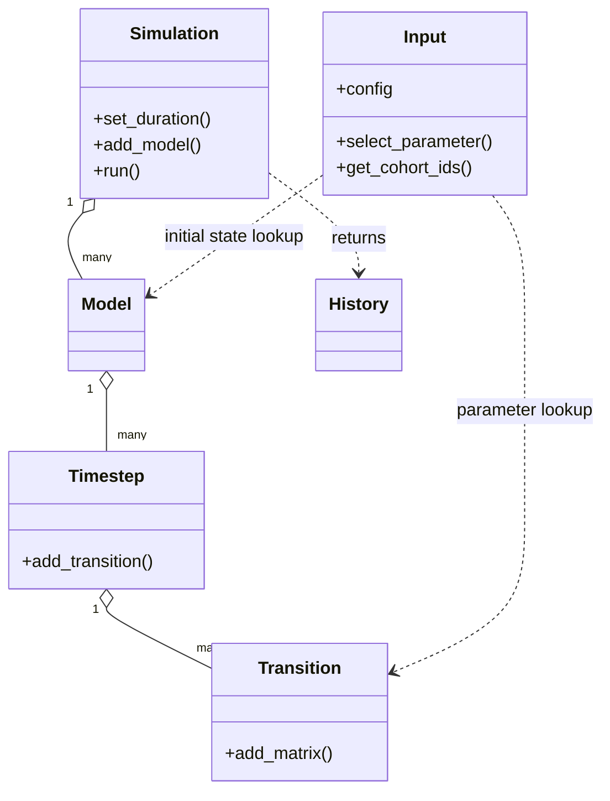
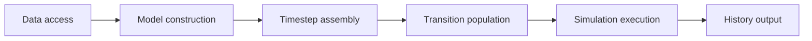

# Explanation: Object Lifecycle

This page describes the main runtime objects and how ownership flows through
the simulation assembly process.

See also:
- [How-To: Build a Single Cohort Model](../how_to/single_model_build.md)
- [References: Runtime Objects](../references/runtime_objects.md)
- [Tutorial: First End-to-End Simulation Run](../tutorials/first_run.md)

## Runtime Ownership

## Class Roles

## Assembly Boundaries

