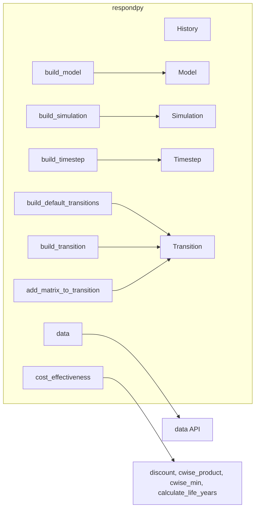
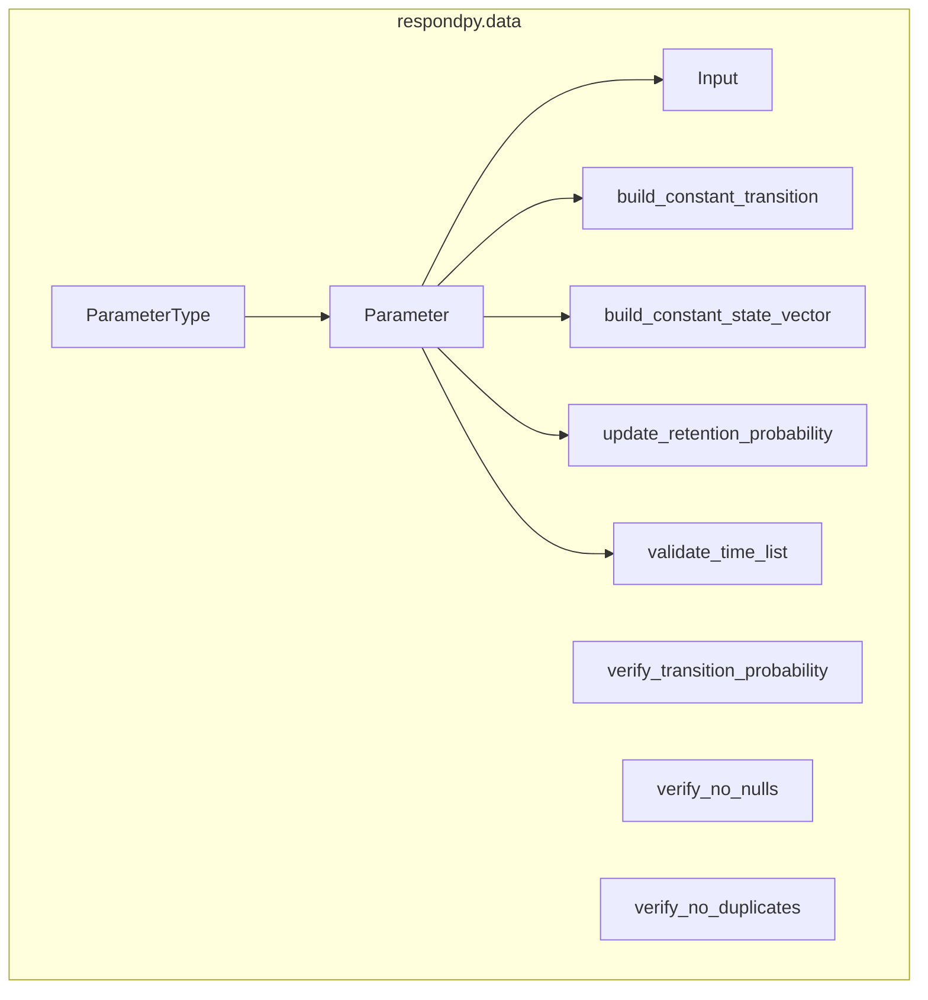
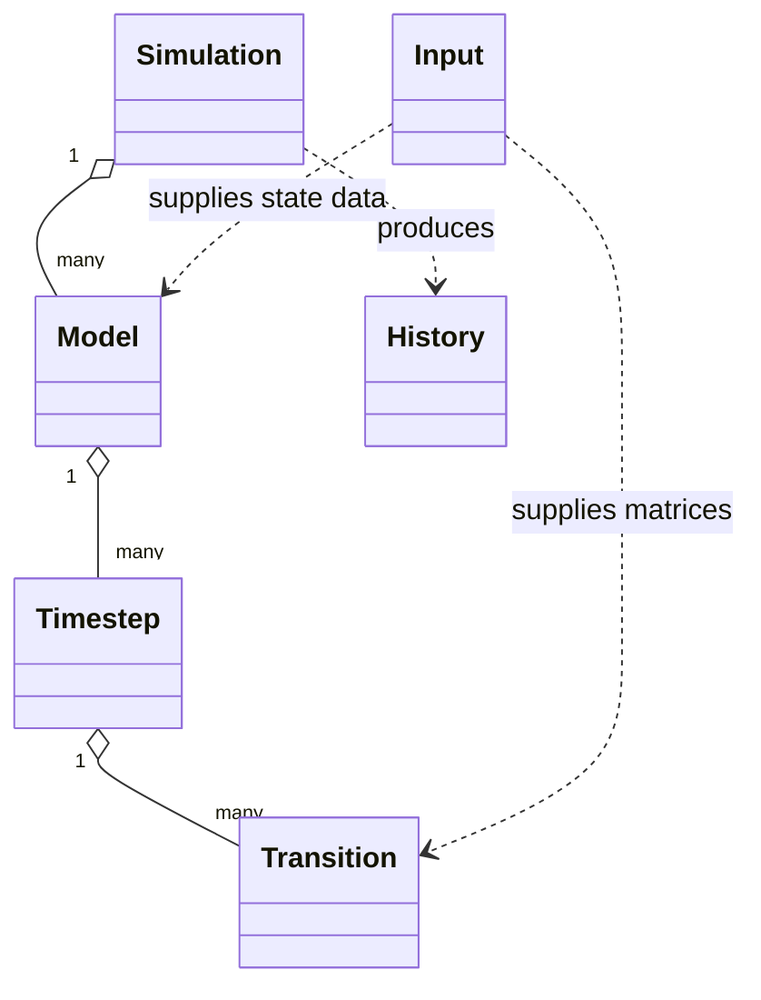

# Explanation: Public API

This page summarizes the top-level modules and classes that make up the
library surface exposed by `respondpy`.

See also:
- [How-To Guides](../how_to/data_loading.md)
- [References](../references/wrapper_typing.md)
- [Tutorials](../tutorials/base_respond.md)

## Package Surface

## Data Namespace

## Public Classes

