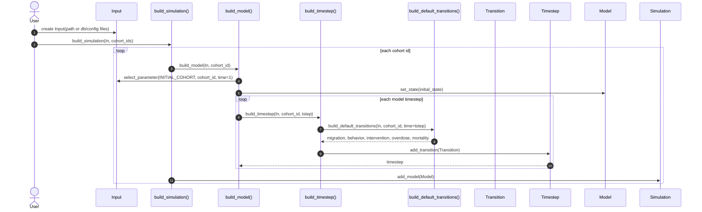
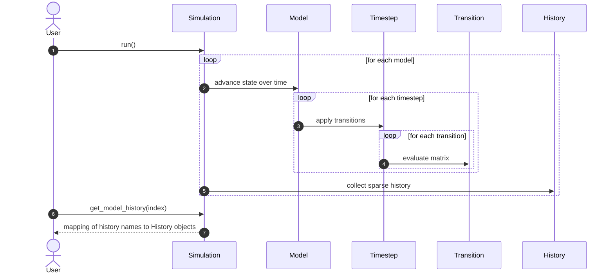

# Explanation: Runtime Execution

This page shows the construction and execution sequence of a simulation run.

See also:
- [How-To: Build and Run a Simulation](../how_to/run_simulation.md)
- [References: respondpy.build](../references/build.md)
- [Tutorial: First End-to-End Simulation Run](../tutorials/first_run.md)

## Build Sequence

## Execution Sequence

