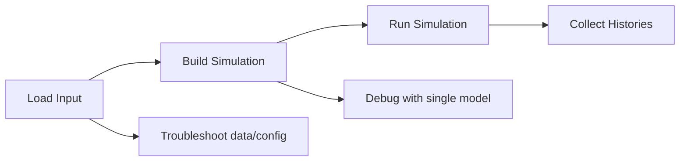

# How-To Guides

These guides are task-oriented workflows for engineers embedding RESPOND via
respondpy. They use high-level build helpers first and keep examples runnable.

For guided learning paths, use [Tutorials](../tutorials/base_respond.md).
For conceptual runtime background, use
[Explanations](../explanations/architecture.md).
For API-level symbol details, use [References](../references/wrapper_typing.md).

```{toctree}
:maxdepth: 1

load_input_data
run_simulation
cohort_subset_and_logging
single_model_build
troubleshooting
```

## Workflow Map


