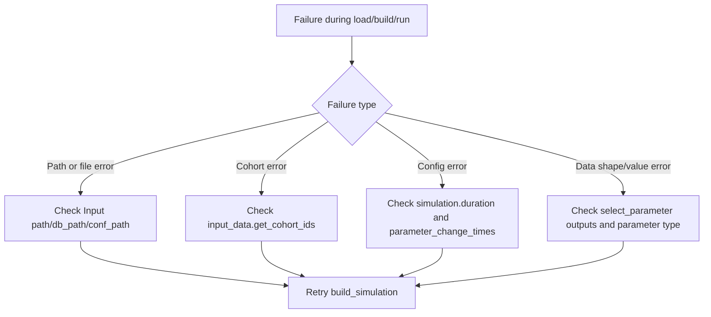

# How-To: Troubleshoot Common Embedding Issues

Use this guide when a high-level build workflow fails during setup or runtime.

See also:
- [How-To: Load RESPOND Input Data](load_input_data.md)
- [How-To: Build and Run a Simulation](run_simulation.md)
- [References: respondpy.data](../references/data.md)
- [Explanation: Data Flow](../explanations/data-flow.md)

## Database or config file not found

```python
from pathlib import Path

from respondpy.data import Input

try:
    Input(path=Path("/bad/path"))
except FileNotFoundError as exc:
    print(exc)
```

## Missing required input arguments

```python
from respondpy.data import Input

try:
    Input()
except ValueError as exc:
    print(exc)
```

## Invalid cohort IDs in build_simulation

```python
from pathlib import Path

from respondpy.build import build_simulation
from respondpy.data import Input

input_data = Input(path=Path("/path/to/respond-input"))

try:
    build_simulation(input_data, cohort_ids=[-1])
except ValueError as exc:
    print(exc)
```

## Invalid parameter change times in config

```python
from respondpy.data import validate_time_list

try:
    validate_time_list([0, 12])
except ValueError as exc:
    print(exc)
```

## Unsupported parameter in low-level calls

```python
from pathlib import Path

from respondpy.data import Input, Parameter, ParameterType

input_data = Input(path=Path("/path/to/respond-input"))

parameter = Parameter(ParameterType.MIGRATION_COHORT)
print(input_data.select_parameter(parameter, cohort_id=1, time=1).shape)
```

## Troubleshooting Flow

