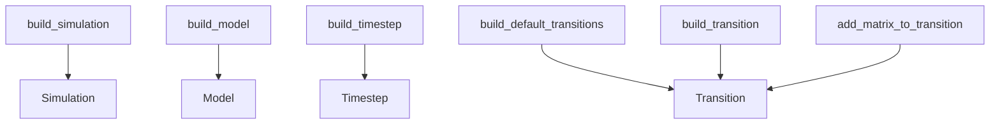

# Reference: respondpy.build

API reference for high-level simulation and model assembly helpers.

## Upstream RESPOND requirement

This release is built against the RESPOND logging hotfix at commit
`d5bb07a1d9bfecfc192db8a5610f1ed1672bcb8a`. The commit is pinned in the
repository's CMake configuration because the runtime configuration and
logging bindings depend on the public headers and behavior introduced there.
Do not substitute an older RESPOND checkout when reproducing a source build.

The package metadata for this release is `respondpy` version `0.3.3`, supports
Python 3.11 and newer, and publishes typed runtime objects through the wheel.

See also:
- [Explanation: Runtime Execution](../explanations/runtime-execution.md)
- [How-To: Build and Run a Simulation](../how_to/run_simulation.md)
- [Tutorial: First End-to-End Simulation Run](../tutorials/first_run.md)

```{automodule} respondpy.build
:members:
:undoc-members:
:show-inheritance:
```

## Helper Relationships

