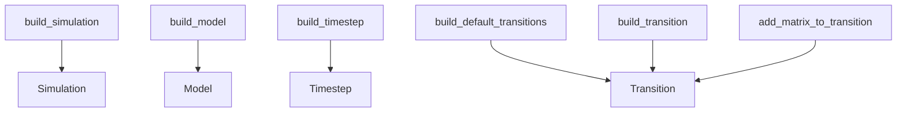

# Reference: respondpy.build

API reference for high-level simulation and model assembly helpers.

See also:
- [Explanation: Runtime Execution](../explanations/runtime-execution.md)
- [How-To: Build and Run a Simulation](../how_to/run_simulation.md)
- [Tutorial: First End-to-End Simulation Run](../tutorials/first_run.md)

```{automodule} respondpy.build
:members:
:undoc-members:
:show-inheritance:
```

## Helper Relationships

