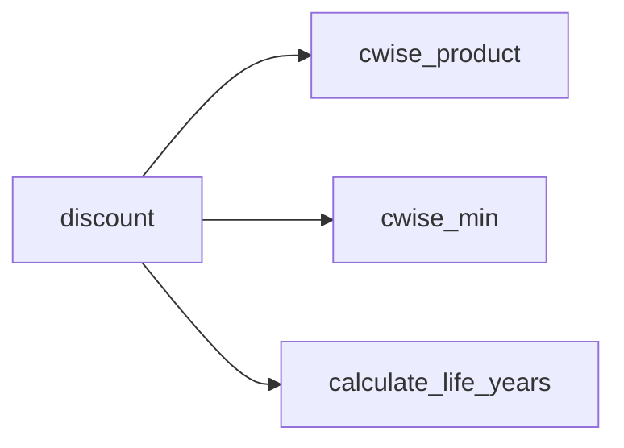

# Reference: respondpy.cost_effectiveness

API reference for cost-effectiveness helper functions exported by respondpy.

See also:
- [Explanations](../explanations/architecture.md)
- [How-To Guides](../how_to/data_loading.md)
- [Tutorials](../tutorials/base_respond.md)

```{automodule} respondpy.cost_effectiveness
:members:
:undoc-members:
:show-inheritance:
```

## Function Surface

