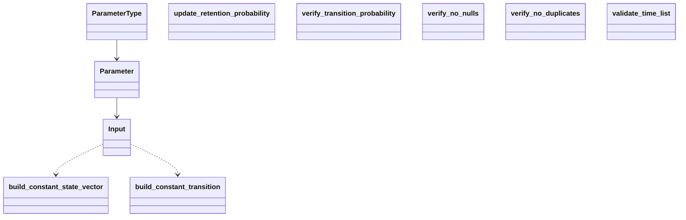

# Reference: respondpy.data

API reference for the data namespace, including input access and validation
helpers.

See also:
- [Explanation: Data Flow](../explanations/data-flow.md)
- [How-To: Load RESPOND Input Data](../how_to/load_input_data.md)
- [Tutorial: Parameter Change-Time Experiment](../tutorials/parameter_change_experiment.md)

```{automodule} respondpy.data
:members:
:undoc-members:
:show-inheritance:
```

## Public Symbols

