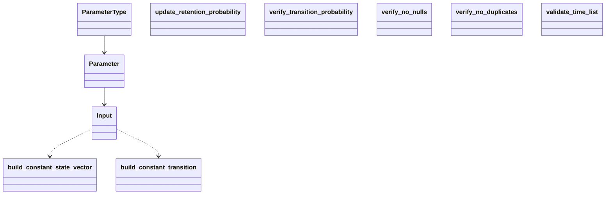

# Reference: respondpy.data

API reference for the data namespace, including input access and validation
helpers.

See also:
- [Explanation: Data Flow](../explanations/data-flow.md)
- [How-To: Load RESPOND Input Data](../how_to/load_input_data.md)
- [Tutorial: Parameter Change-Time Experiment](../tutorials/parameter_change_experiment.md)

```{automodule} respondpy.data
:members:
:undoc-members:
:show-inheritance:
```

`Input` owns its SQLite connection. Call `Input.close()` when the data source
is no longer needed, or use it as a context manager with `with Input(...) as
input_data:`. Closing is idempotent, and database operations after closing
raise `ConnectionError`.

Simulation construction requires a `[simulation]` section containing a
positive integer `duration` and whitespace-separated list of integers
`parameter_change_times`. Change times may be empty; zero or negative values
are rejected with `ValueError`.

The database must contain the RESPOND core tables `cohort`, `intervention`,
`behavior`, `initial_population`, `population_change`,
`intervention_transition`, `behavior_transition`, `overdose`,
`overdose_fatality`, `background_mortality`, and `smr`, with the columns used
by the corresponding parameter families. Incomplete schemas are rejected when
`Input` is constructed.

## Public Symbols


```mermaid
classDiagram
	class ParameterType
	class Parameter
	class Input
	class build_constant_state_vector
	class build_constant_transition
	class update_retention_probability
	class verify_transition_probability
	class verify_no_nulls
	class verify_no_duplicates
	class validate_time_list

	ParameterType --> Parameter
	Parameter --> Input
	Input ..> build_constant_state_vector
	Input ..> build_constant_transition
```