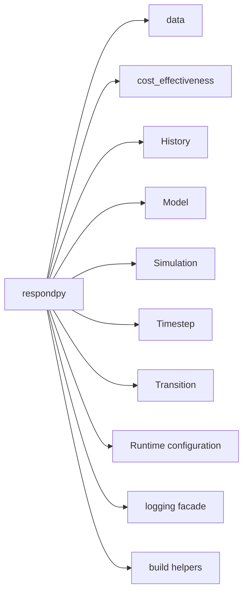

# Reference: respondpy Package

API reference for top-level symbols exported by `respondpy`.

The runtime configuration classes `ExecutionConfig`, `LoggingConfig`, and
`RuntimeConfig` are exported here as well as from `respondpy.config`. The
logging facade is available as `respondpy.logging`, and its functions share
the native RESPOND logging backend with C++ runtime objects.

See also:
- [Explanations](../explanations/architecture.md)
- [How-To Guides](../how_to/data_loading.md)
- [Tutorials](../tutorials/base_respond.md)

```{automodule} respondpy
:members:
:undoc-members:
:show-inheritance:
```

## Export Map

