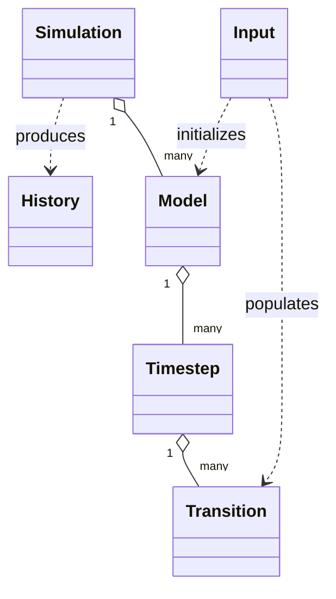

# Reference: Runtime Objects

API reference for runtime classes exposed through the core wrapper modules.

See also:
- [Explanation: Object Lifecycle](../explanations/object-lifecycle.md)
- [How-To: Build a Single Cohort Model](../how_to/single_model_build.md)
- [Tutorial: Interpret Model Histories](../tutorials/history_interpretation.md)

```{automodule} respondpy.history
:members:
:undoc-members:
:show-inheritance:
```

```{automodule} respondpy.model
:members:
:undoc-members:
:show-inheritance:
```

```{automodule} respondpy.simulation
:members:
:undoc-members:
:show-inheritance:
```

```{automodule} respondpy.timestep
:members:
:undoc-members:
:show-inheritance:
```

```{automodule} respondpy.transition
:members:
:undoc-members:
:show-inheritance:
```

## Runtime Graph

