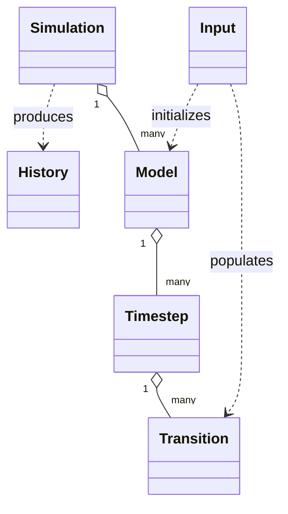

# Reference: Runtime Objects

API reference for runtime classes exposed through the core wrapper modules.

See also:
- [Explanation: Object Lifecycle](../explanations/object-lifecycle.md)
- [How-To: Build a Single Cohort Model](../how_to/single_model_build.md)
- [Tutorial: Interpret Model Histories](../tutorials/history_interpretation.md)

```{automodule} respondpy.history
:members:
:undoc-members:
:show-inheritance:
```

```{automodule} respondpy.model
:members:
:undoc-members:
:show-inheritance:
```

```{automodule} respondpy.simulation
:members:
:undoc-members:
:show-inheritance:
```

## Runtime Configuration

`ExecutionConfig`, `LoggingConfig`, and `RuntimeConfig` are available from
both `respondpy.config` and the top-level `respondpy` namespace. A newly
constructed configuration uses these defaults:

| Setting | Default | Meaning |
| --- | --- | --- |
| `ExecutionConfig.total_threads` | `0` | Let RESPOND select the worker-thread count. |
| `ExecutionConfig.eigen_threads` | `1` | Eigen worker threads used inside a model. |
| `ExecutionConfig.run_models_concurrently` | `False` | Execute models sequentially. |
| `LoggingConfig.logger_name` | `"respond"` | Logger used by runtime objects. |
| `LoggingConfig.file_path` | `"respond.log"` | Default log-file destination. |
| `LoggingConfig.use_shared_sink` | `False` | Use an existing shared file sink. |

Pass a `RuntimeConfig` to `Simulation` or to the runtime-config `Model`
factory overload. The execution configuration can also be read or replaced
through `Simulation.get_execution_config()`,
`Simulation.set_execution_config()`, `Simulation.get_runtime_config()`, and
`Simulation.set_runtime_config()`.

When `run_models_concurrently` is enabled and more than one model actually
runs in parallel, `eigen_threads` must be less than or equal to `1` because
Eigen's worker setting is process-global. Use `total_threads=0` for the
implementation-selected worker count or set an explicit positive value.

```{automodule} respondpy.timestep
:members:
:undoc-members:
:show-inheritance:
```

```{automodule} respondpy.transition
:members:
:undoc-members:
:show-inheritance:
```

## Runtime Graph

