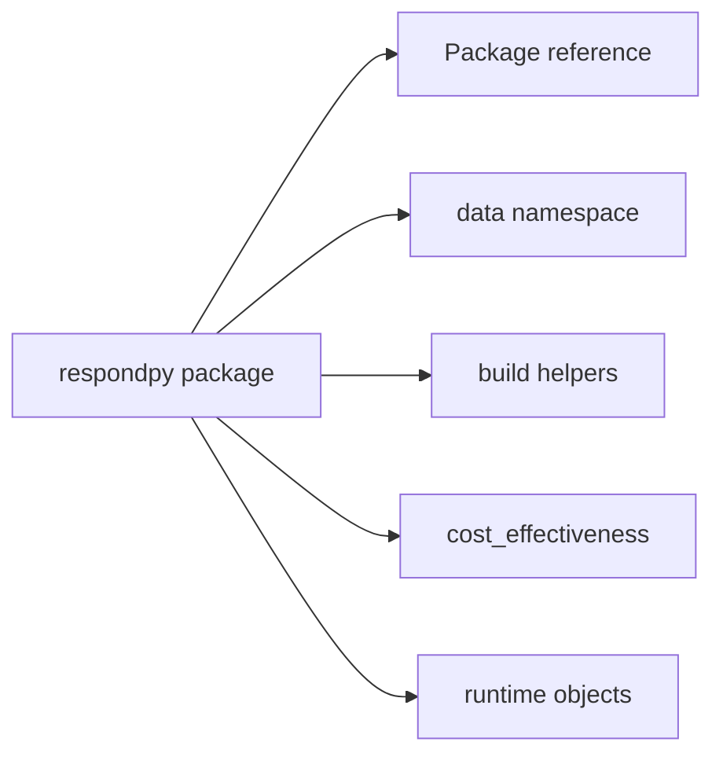

# References

This section contains technical reference material for the public API and
runtime-facing modules exposed by respondpy.

The package ships typing declarations for the native runtime classes and
their Python facades. The runtime-config constructors and simulation accessors
are typed with `RuntimeConfig` and `ExecutionConfig`; logging functions use
the `LoggingConfig`, `CreationStatus`, `LogType`, and `LogPattern` types from
`respondpy.logging`.

The deprecated model and simulation construction overloads remain declared so
existing callers continue to type-check while migrating to `RuntimeConfig`.

For conceptual architecture and execution behavior, use
[Explanations](../explanations/architecture.md).
For operational workflows, use [How-To Guides](../how_to/data_loading.md).
For stepwise onboarding exercises, use [Tutorials](../tutorials/base_respond.md).

```{toctree}
:maxdepth: 1

package
logging
data
build
cost_effectiveness
runtime_objects
```

## Scope


