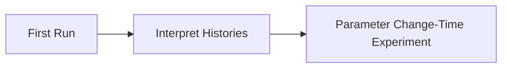

# Tutorials

These tutorials are guided learning paths for general researchers using
respondpy.

For direct problem-solving recipes, use [How-To Guides](../how_to/data_loading.md).
For conceptual architecture and internals, use
[Explanations](../explanations/architecture.md).
For API signatures and object-level detail, use
[References](../references/wrapper_typing.md).

```{toctree}
:maxdepth: 1

first_run
history_interpretation
parameter_change_experiment
```

## Learning Path

