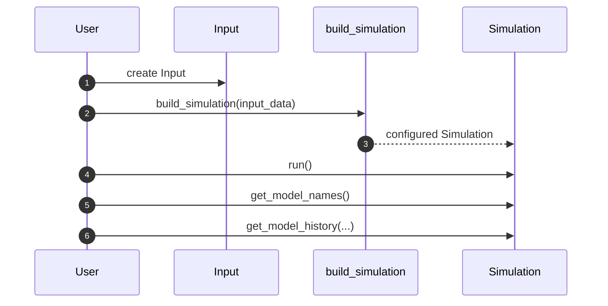

# Tutorial: First End-to-End Simulation Run

This tutorial walks through a complete run: load RESPOND input files,
construct a simulation from all cohorts, execute it, and inspect model-level
history handles.

See also:
- [How-To: Build and Run a Simulation](../how_to/run_simulation.md)
- [References: respondpy.build](../references/build.md)
- [Explanation: Runtime Execution](../explanations/runtime-execution.md)

## Step 1: Initialize Input

```python
from pathlib import Path

from respondpy.data import Input

input_data = Input(path=Path("/path/to/respond-input"))
cohort_ids = input_data.get_cohort_ids()

print("Cohorts:", cohort_ids)
```

## Step 2: Build and run the simulation

```python
from respondpy.build import build_simulation

simulation = build_simulation(input_data)
simulation.run()
```

## Step 3: Inspect model names and history names

```python
model_names = simulation.get_model_names()
index_name_map = simulation.get_model_index_name_map()

print("Model names:", model_names)
print("Index map:", index_name_map)

if model_names:
    first_model_history_names = simulation.get_model_history_names(0)
    print("First model history names:", first_model_history_names)
```

## Step 4: Inspect one model history object

```python
model_history = simulation.get_model_history(0)

for history_name, history in model_history.items():
    print(history_name, type(history).__name__, history.get_name())
```

## Run Flow

