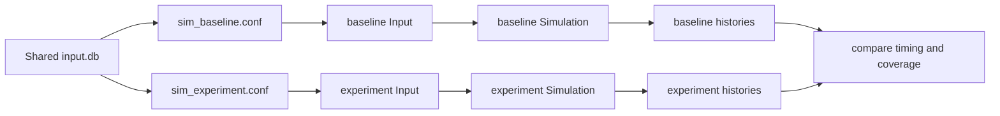

# Tutorial: Parameter Change-Time Experiment

This tutorial compares runs under different `parameter_change_times`
configurations by using separate RESPOND config files that point to the same
database.

See also:
- [How-To: Load RESPOND Input Data](../how_to/load_input_data.md)
- [References: respondpy.data](../references/data.md)
- [Explanation: Data Flow](../explanations/data-flow.md)

## Step 1: Create two Input objects with different config files

```python
from pathlib import Path

from respondpy.data import Input

db_file = Path("/path/to/respond-input/input.db")

baseline_conf = Path("/path/to/respond-input/sim_baseline.conf")
experiment_conf = Path("/path/to/respond-input/sim_experiment.conf")

baseline_input = Input(db_path=db_file, conf_path=baseline_conf)
experiment_input = Input(db_path=db_file, conf_path=experiment_conf)

print(baseline_input.config.get("simulation", "parameter_change_times"))
print(experiment_input.config.get("simulation", "parameter_change_times"))
```

## Step 2: Build and run one simulation per config

```python
from respondpy.build import build_simulation

baseline_sim = build_simulation(baseline_input)
experiment_sim = build_simulation(experiment_input)

baseline_sim.run()
experiment_sim.run()
```

## Step 3: Compare model-level history availability

```python
baseline_model_names = baseline_sim.get_model_names()
experiment_model_names = experiment_sim.get_model_names()

print("baseline models:", baseline_model_names)
print("experiment models:", experiment_model_names)

if baseline_model_names and experiment_model_names:
    baseline_history_names = baseline_sim.get_model_history_names(0)
    experiment_history_names = experiment_sim.get_model_history_names(0)

    print("baseline history names:", baseline_history_names)
    print("experiment history names:", experiment_history_names)
```

## Step 4: Compare latest recorded timestep in each run

```python
baseline_history = baseline_sim.get_model_history(0)
experiment_history = experiment_sim.get_model_history(0)

for history_name in baseline_history:
    if history_name in experiment_history:
        baseline_latest = baseline_history[history_name].get_latest_recorded_timestep()
        experiment_latest = experiment_history[history_name].get_latest_recorded_timestep()
        print(history_name, baseline_latest, experiment_latest)
```

## Experiment Flow

